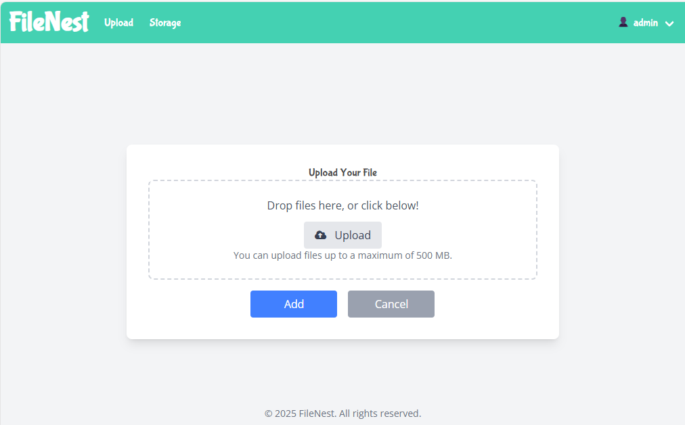
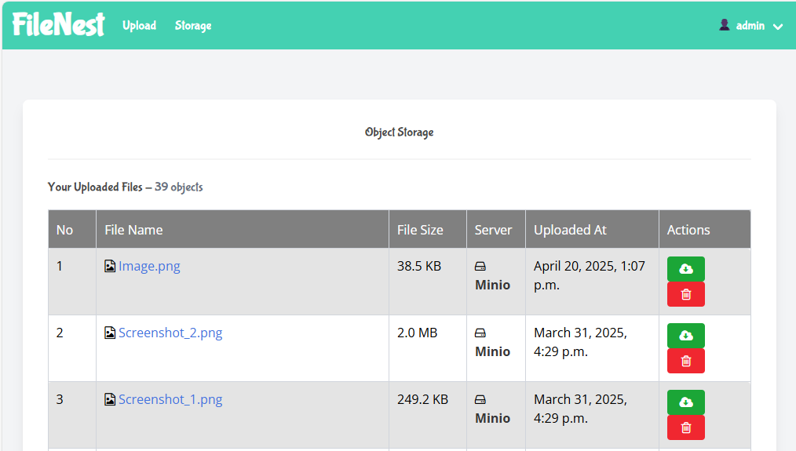
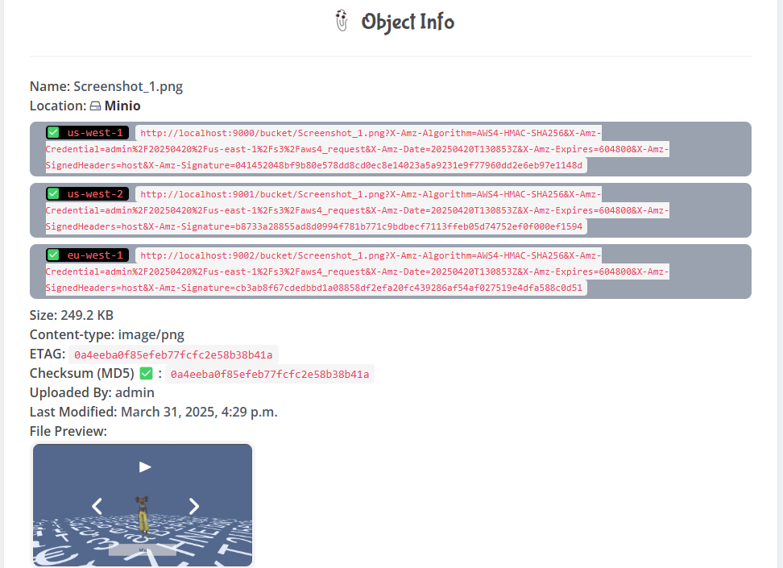
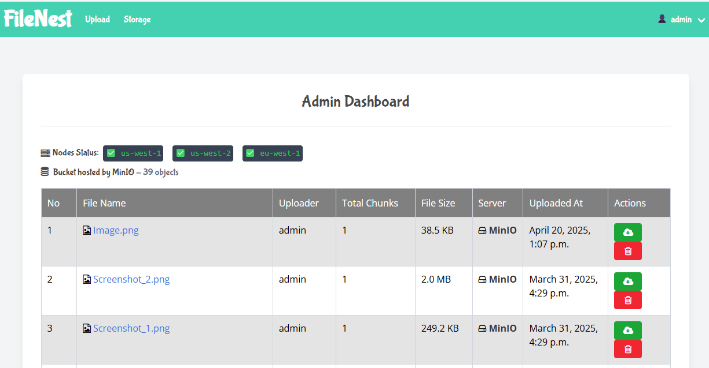
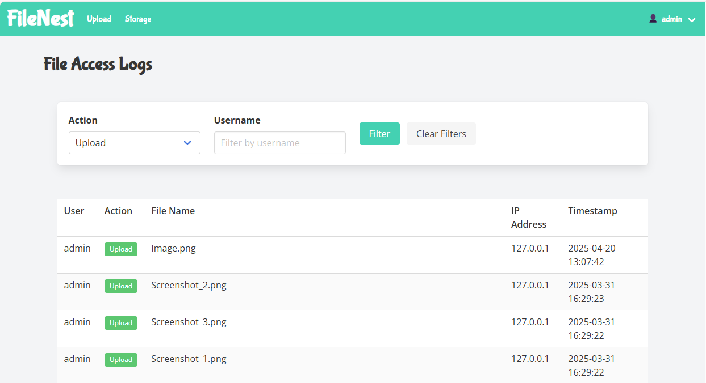
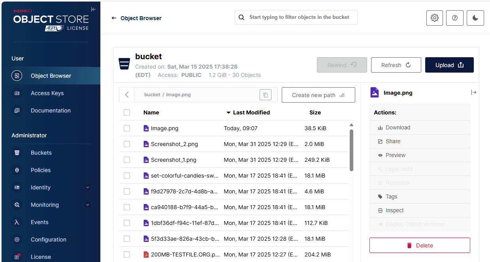

# FileNest Project Setup Guide

FileNest is a distributed file storage system designed for efficiently handling large files and ensuring data redundancy. It utilizes a chunking mechanism to break down files, distributes these chunks across multiple storage nodes (MinIO), and optimizes file retrieval based on geographic location and node load. This system is built to be scalable, reliable, and user-friendly, providing both a robust backend and an intuitive web interface for file management.

# Project Features

## Prerequisites

Ensure you have the following installed on your machine:

Python 3.13 or later

Git (for version control)

Virtual Environment (venv)

Docker


## Project Features


| **Status**   | **Feature Description** |
|--------------| ------- |
| ✅ Done       | File chunking mechanism for handling large files efficiently   |
| ✅ Done       | APIs for file upload, chunk distribution, and retrieval   |
| ✅ Done       | Distributed storage system integration using MinIO   |
| ✅ Done       | File replication for redundancy and data integrity   |
| ✅ Done       | Error detection mechanisms such as checksums for file verification   |
| ✅ Done       | Recovery mechanisms for handling failures or corrupted chunks  |
| ✅ Done       | Retrieval logic to fetch files from the nearest or least-loaded node  |
| ✅ Done       | Caching strategies for frequently accessed files to improve performance  |
| ✅ Done       | User-friendly interface for file uploads and downloads  |
| ✅ Done       | Admin panel to monitor file distribution and node statuses  |
| ✅ Done       | Logging and reporting functionalities to track file access and storage operations  |
| ✅ Done       | Secure authentication and authorization using API tokens  |


## ✅ Done: Refactoring of Web Views

The web views have been refactored to improve code organization and maintainability.
The views are now organized into subfolders based on their functionality:

- `web/views/admin`: Contains views related to admin functionalities.
- `web/views/auth`: Contains views related to authentication (login, signup, logout).
- `web/views/files`: Contains views related to file operations (upload, detail, delete, storage).

This change improves the structure of the `web/views` directory, making it easier to navigate and manage the views.


## ✅ Done: Code Organization

To further improve the project structure, the `web/views` directory has been reorganized.
Each view function is now located in its respective subfolder under `web/views`.
For example:

- Authentication views (`user_login`, `user_signup`, `user_logout`) are now in `web/views/auth/auth.py`.
- File management views (`file_upload`, `file_detail`, `delete_file`, `load_storage`) are in `web/views/files/files.py`.
- Admin views (`admin_dashboard`) are in `web/views/admin/admin.py`.

The `web/views/__init__.py` file has been updated to import the views from these subfolders.
This modular structure enhances code discoverability and maintainability.

## Retrieval Optimization Features

FileNest now includes sophisticated retrieval optimization capabilities:

### Intelligent File Retrieval
- **Geo-Aware Node Selection**: Files are retrieved from the nearest storage node based on the user's location
- **Load-Based Optimization**: When geographic data isn't available, the system automatically selects the least loaded node
- **Performance Tracking**: Each node's performance is continuously monitored to improve future retrieval decisions
- **Automatic Failover**: If a preferred node fails, the system seamlessly falls back to alternative nodes

### File Caching System
- **Efficient Caching**: Frequently accessed files are cached to reduce latency and server load
- **Smart Cache Management**: Files are cached based on size and access patterns
- **Cache Control**: API supports optional cache bypass with the `no_cache` parameter
- **Automatic Cache Invalidation**: Cache entries are automatically cleared when files are modified or deleted

### API Enhancements
- **Location-Aware Downloads**: Clients can provide their geographic coordinates for optimal node selection
- `/api/download/<file_id>/?lat=<latitude>&lon=<longitude>` - Downloads file from the nearest node
- `/api/download/<file_id>/?no_cache=1` - Forces a fresh download bypassing the cache

### Clone the Repository
[Repository link](https://github.com/tonidevvn/FileNest)
```
git clone [Repository link]
cd FileNest
```

## Deploying Multiple MinIO Nodes
For distributed storage testing, you can use Docker Compose to run multiple MinIO nodes:

```
docker-compose up -d
```

The included docker-compose.yml configures multiple nodes with different geographical locations.

### Start MinIO (Single Node)
```
docker run -p 9000:9000 -p 9001:9001 -e "MINIO_ROOT_USER=admin" -e "MINIO_ROOT_PASSWORD=minioadmin" minio/minio server /data --console-address ":9001"
```

Verify MinIO is Running\
Open a browser and go to http://localhost:9001 (or your server IP if remote).\
Log in with the credentials (admin/minioadmin for the Docker example).\
You should see the MinIO web interface.


### Create and Activate Virtual Environment

```
python -m venv .venv
source .venv/bin/activate  # On macOS/Linux
# OR
.venv\Scripts\activate    # On Windows
```

### Install Dependencies

```
pip install --upgrade pip
pip install -r requirements.txt
```

### Create a Superuser (For Admin Panel - Optional)

Follow the prompts to set up the admin account.
```
python manage.py createsuperuser
```

### Start the Development Server

Follow the prompts to access the app at: http://127.0.0.1:8000/
```
python manage.py runserver
```

## 🖼️ Screenshots












