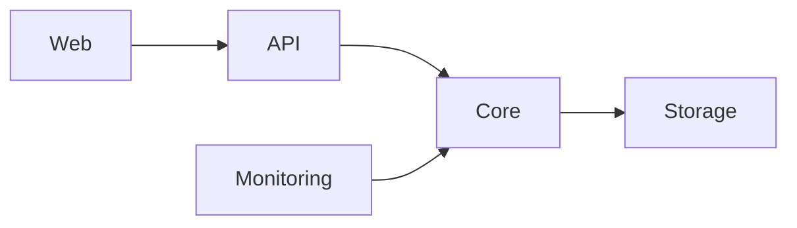

# System Patterns

## Architecture:
FileNest follows a microservices-inspired architecture, with distinct components for API, core logic, web interface, and monitoring.

- **Web (web/):**  Handles user interface and user interactions, built with Django templates and static files.
- **API (api/):**  Provides RESTful API endpoints for web interface and potentially other clients, built with Django REST framework.
- **Core (core/):**  Contains core application logic, business rules, and data models, implemented in Django.
- **Monitoring (monitoring/):**  Implements monitoring and admin dashboard features, built as a Django app.
- **Storage (core/minio/):**  Handles file storage using MinIO, providing object storage capabilities.

## Design Patterns:
- **RESTful API:** API endpoints follow REST principles for stateless and scalable communication.
- **Model-View-Template (MVT):** Django's MVT pattern is used for structuring web and API components.
- **Service Layer:** Core logic is encapsulated in services (core/services.py) to promote separation of concerns and testability.
- **Object Storage:** MinIO is used as object storage backend for efficient file management.

## Key Technical Decisions:
- **Django Framework:** Chosen for rapid development, robust ORM, and built-in admin features.
- **MinIO:** Selected for scalable and cost-effective object storage.
- **Docker and Docker Compose:** Used for containerization and simplified deployment.

## Component Relationships:
- Web interface interacts with API endpoints to perform actions like file upload, download, and sharing.
- API layer orchestrates core services to handle business logic and data persistence.
- Monitoring component interacts with core services to collect and display system metrics.
- Core services interact with MinIO storage to manage file operations.
